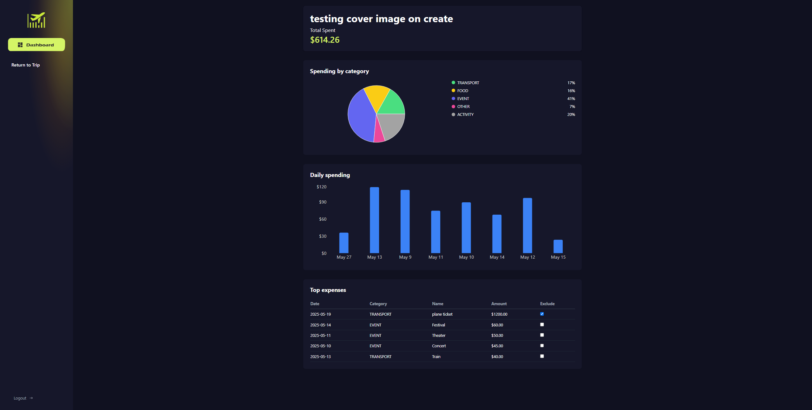

# Expense Tracker App

An app to help you plan, track, and manage your travel expenses with a clean UI and simple user flow.

---

## Features

- User authentication with JWT-based login and registration
- Create, view, edit, and delete trips and expenses
- Dashboard with summary and detailed reports
- Responsive design for desktop and mobile
- Secure backend API with Spring Boot and MySQL

---
## Demo Video

---

## Screenshots

### Dashboard

### Mobile Dashboard

### Trip Details

### Spending Report

---

### Note

In order to run please create a file in expense-tracker-api\expense-tracker\src\main\resources titled application properties
and add to it the following with your local mysql information filled in.
Note as this is local and the authentication not necessary I have opted to just put in the jwt secret and sensitive mysql information here but you can abstract it to env variables if need be

spring.datasource.url=jdbc:mysql:Your_mysql_db_here
spring.datasource.username=Your_mysql_username
spring.datasource.password=Your_mysql_password
spring.datasource.driver-class-name=com.mysql.cj.jdbc.Driver

spring.jpa.hibernate.ddl-auto=update
spring.jpa.show-sql=true
spring.jpa.properties.hibernate.dialect=org.hibernate.dialect.MySQL8Dialect
server.port=8080

jwt.secret=your_generated_secret_here
